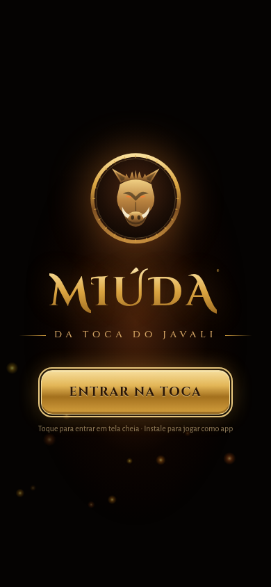
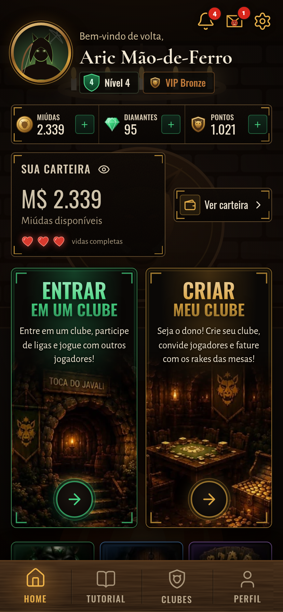
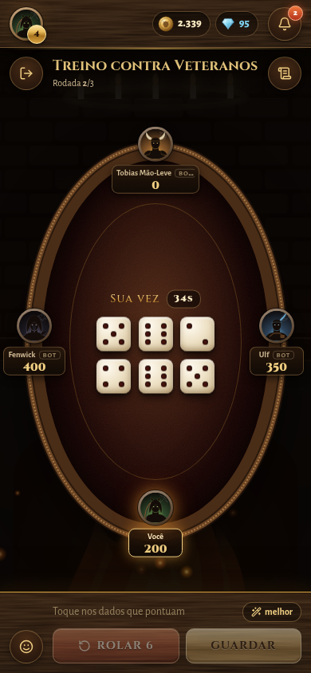
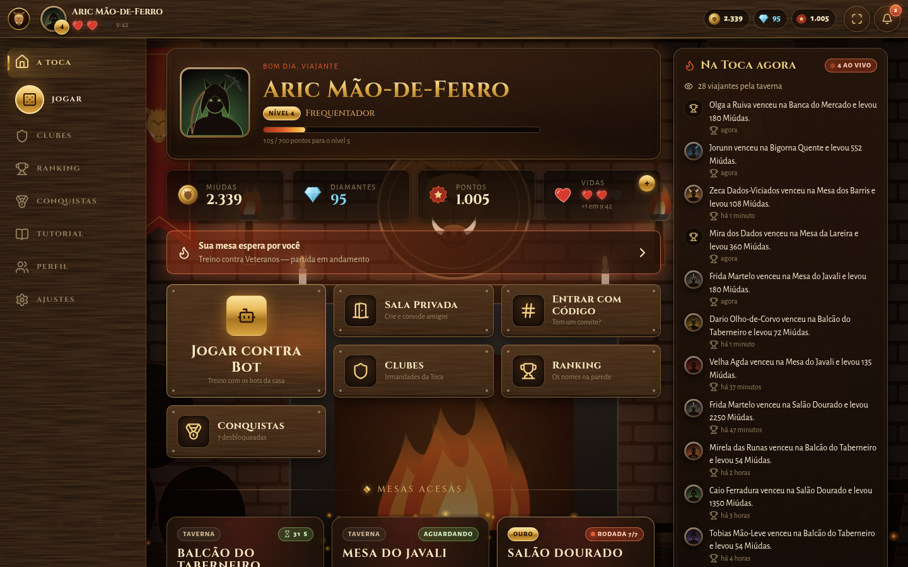
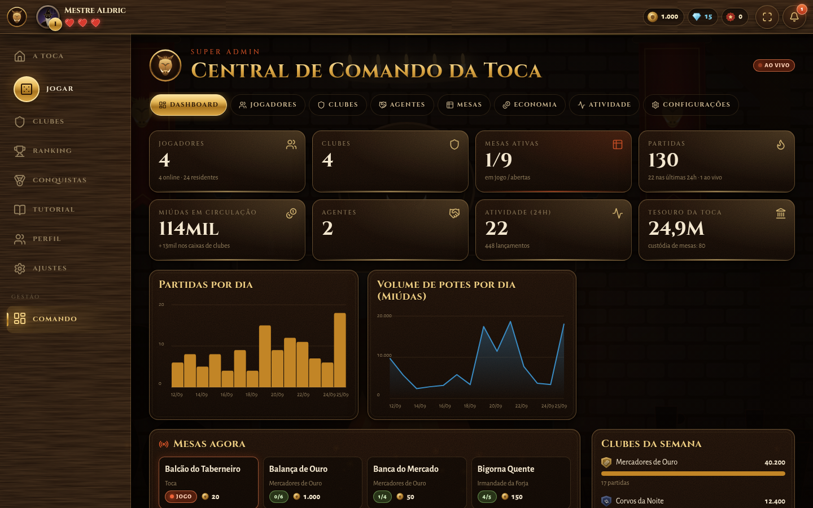
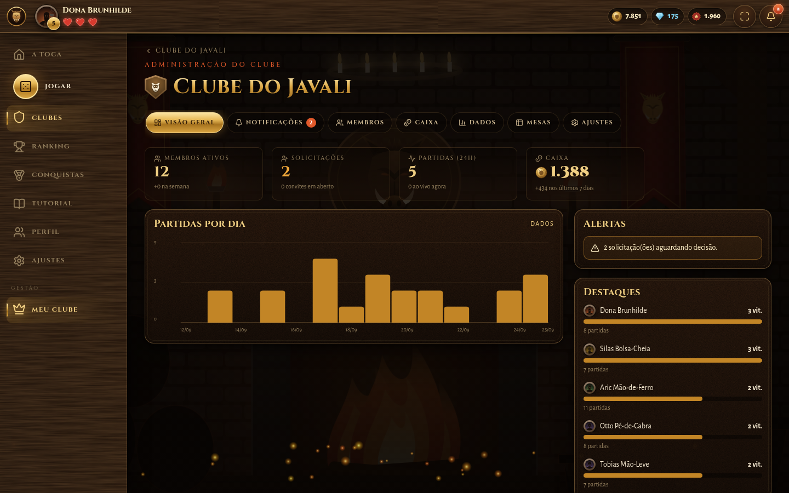

# MIÚDA® — Da Toca do Javali

> Um universo de jogos numa grande taverna dark fantasy. Entre na **Toca do Javali**, sente-se às mesas de dados, junte-se a clubes, acumule **Miúdas**, ganhe **diamantes**, suba de nível e grave seu nome na Parede da Fama.

<p align="center">
  
  
  
</p>
<p align="center">
  
</p>
<p align="center">
  
  
</p>

---

## Sumário

1. [Visão do produto](#visão-do-produto)
2. [O jogo: Dados do Javali](#o-jogo-dados-do-javali)
3. [Arquitetura e decisões técnicas](#arquitetura-e-decisões-técnicas)
4. [Estrutura do projeto](#estrutura-do-projeto)
5. [Rodando localmente](#rodando-localmente)
6. [Publicando na Netlify](#publicando-na-netlify)
7. [Variáveis de ambiente](#variáveis-de-ambiente)
8. [Banco de dados](#banco-de-dados)
9. [Usuários demo, papéis e modo de desenvolvimento](#usuários-demo-papéis-e-modo-de-desenvolvimento)
10. [Economia](#economia)
11. [Segurança](#segurança)
12. [Testes](#testes)
13. [API](#api)
14. [Próximos passos](#próximos-passos)

---

## Visão do produto

A MIÚDA abre **em tela cheia, como um app**: uma introdução cinematográfica acende o medalhão do Javali, revela **MIÚDA®**, depois **DA TOCA DO JAVALI** e o botão **ENTRAR NA TOCA** — que ativa a tela cheia, toca o som da porta e mergulha o jogador na taverna. O projeto é um **PWA instalável** (`display: fullscreen`), com ícones, splash e funcionamento offline do app shell.

O fluxo principal é `ABRIR → ENTRAR NA TOCA → HOME → ATIVIDADE → JOGAR → RESULTADO → RECOMPENSA → PROGRESSÃO`, e o jogador pode explorar clubes, ranking, perfil, conquistas, tutorial, notificações, salas e configurações.

| Área | O que existe |
|---|---|
| **A Toca (Home)** | Cartão do viajante (avatar, título, nível), Miúdas/Diamantes/Pontos/Vidas, placas de ação, mesas ao vivo, feed "Na Toca agora", Parede da Fama, atalho "Sua mesa espera por você" |
| **Jogar** | Mesas da Toca e de clubes (jogadores, capacidade, entrada, prêmio, status, espectadores, categoria), Contra Bot (3 dificuldades), Sala Privada (código de 6 letras), Entrar com Código |
| **Mesa** | Mesa oval com assentos ao redor, dados animados, turnos com cronômetro, "JAVALI!", dados quentes, reações rápidas, placar, histórico, espectadores, tela de resultado com recompensas |
| **Clubes** | Descobrir, entrar/solicitar/convite, criar (assistente com prévia do estandarte), membros, mesas exclusivas, atividade, regras, caixa |
| **Administração do clube** | Visão Geral · Notificações (solicitações/convites/alertas/atividades) · Membros (funções, agentes, comissões, remover/banir) · Caixa (saldo, entradas, saídas, pagamentos) · Dados (gráficos) · Mesas · Ajustes |
| **Agente** | Jogadores vinculados, desempenho, comissões por dia, histórico, convites que vinculam, transferências |
| **Super Admin / Central de Comando** | KPIs (jogadores, clubes, mesas ativas, partidas, Miúdas em circulação, agentes, atividade), gráficos, mesas ao vivo; Jogadores (ajuste de saldo, banir, papéis), Clubes (suspender), Agentes, Mesas, Economia (oferta, distribuição, lançamentos), Atividade, Configurações globais e reset |
| **Perfil** | Estatísticas, clubes, personagens (10, com desbloqueio por nível/diamantes), Relicário (molduras e títulos), histórico de partidas, extrato com filtros e transferências |
| **Progressão** | Pontos → nível → títulos; 17 conquistas com diamantes e pontos; ranking (reputação, semana, vitórias, clubes) |
| **Vidas** | 3 vidas para treinos; derrota contra bot custa 1; regeneração automática (20 min, configurável); recarga com diamantes; bloqueio sem vidas |
| **Notificações** | Convites (com Aceitar/Entrar), solicitações (com Aprovar), partidas, recompensas, transferências, conquistas, sistema; marcar como lida, limpar |
| **Tutorial** | Onboarding visual em 9 capítulos guiado por Aldren, o Sábio (aparece no primeiro acesso) |

### A Toca é viva
Há **24 residentes** (NPCs) com histórico real, clubes e mesas. Um "tick do mundo" (executado sob demanda, adequado a serverless) senta residentes em mesas vazias, faz contagens regressivas, joga as partidas deles com a IA e reabre as mesas — então o lobby sempre tem partidas acontecendo, o feed se move e as métricas crescem. Quando um jogador de verdade entra numa mesa cheia, um residente cede o lugar.

## O jogo: Dados do Javali

Jogo de dados de taverna (família *Farkle*), por turnos, de 2 a 6 jogadores:

1. Role 6 dados e separe ao menos uma combinação que pontua.
2. Arrisque rolar os restantes **ou** guarde os pontos do turno.
3. Rolagem sem nada que pontue → **JAVALI!** (perde os pontos do turno).
4. Pontuou com os 6 dados → **dados quentes**: role os 6 de novo.
5. Após N rodadas (3/5/7/9), maior pontuação vence e leva o prêmio (empates dividem).

| Combinação | Pontos |
|---|---|
| 1 / 5 | 100 / 50 |
| Trinca de 1 / de N | 1000 / N×100 |
| Quadra / Quina / Sena | trinca ×2 / ×3 / ×4 |
| Sequência 1–6 / Três pares | 1500 / 750 |

Os bots têm três perfis (Aprendiz, Veterano, Mestre): o Mestre prefere seleções mínimas para manter dados, lê o placar e arrisca mais quando está atrás na última rodada. Humanos têm 35 s por ação; após 3 tempos esgotados são considerados ausentes e a casa joga por eles.

## Arquitetura e decisões técnicas

```
┌──────────── Navegador (PWA, tela cheia) ────────────┐
│ React 19 + TypeScript + Vite · Design System próprio │
│ React Query (estado do servidor, polling)            │
│ Web Audio (sons sintetizados) · SVG/Canvas (arte)    │
└───────────────────────┬──────────────────────────────┘
                        │ HTTPS /api/*  (JSON, Bearer token)
┌───────────────────────▼──────────────────────────────┐
│ Hono API — Netlify Function (produção) / Node (local)│
│ Auth · Usuários · Carteiras/Livro-razão · Partidas   │
│ Salas/Mesas · Clubes · Agentes · Notificações ·      │
│ Ranking · Conquistas · Super Admin · Tick do mundo   │
│ shared/: regras do jogo, IA, catálogos (1 fonte)     │
└───────────────────────┬──────────────────────────────┘
                        │ SQL (transações, locks de linha)
┌───────────────────────▼──────────────────────────────┐
│ PostgreSQL — Netlify DB / Neon / Supabase / RDS      │
│ (local e testes: PGlite = Postgres em WASM, embutido)│
└──────────────────────────────────────────────────────┘
```

**Por que assim?**

- **Servidor autoritativo.** Rolagens (RNG criptográfico), validação de jogadas, bots, tempos, prêmios e economia rodam no backend. O cliente só exibe e envia intenções — o frontend nunca é camada de segurança.
- **Serverless-friendly.** A API é uma única Netlify Function (`/api/*`). Como funções não mantêm conexões abertas, o tempo real usa *polling* curto (≈0,75 s na mesa) e o avanço do jogo é **preguiçoso e determinístico no tempo**: cada consulta aplica tudo o que já deveria ter acontecido (ações de bots com ritmo "humano", tempos esgotados). A troca futura por WebSocket/SSE não muda as regras.
- **PostgreSQL de verdade.** Economia exige atomicidade: toda movimentação é uma transação com `SELECT … FOR UPDATE`, saldo nunca negativo (CHECK no banco) e lançamentos em partidas dobradas.
- **PGlite no desenvolvimento.** O mesmo SQL roda num Postgres embutido — `npm install && npm run dev` funciona sem instalar nada. Em produção, basta definir `DATABASE_URL`.
- **`shared/` como fonte única.** Regras de pontuação, motor de partida, IA dos bots e catálogos (personagens, conquistas, níveis) são usados pelo servidor e pelo cliente (pré-visualização da seleção).
- **Arte 100% em código.** Personagens (silhuetas iluminadas pela lareira), medalhão, cenário da taverna, ícones e moedas são SVG/CSS/Canvas: sem dependência de imagens externas, nítidos em qualquer tela e leves.
- **Sem infraestrutura desnecessária.** Nada de fila, cache ou websocket gerenciado enquanto não for preciso; a estrutura em serviços permite evoluir.

**Stack:** React 19, React Router 7, TanStack Query 5, Vite 8, TypeScript, Hono 4, Zod 4, `pg`, PGlite, Vitest, Playwright, lucide-react, Fontsource (Cinzel, Cinzel Decorative, Alegreya Sans).

## Estrutura do projeto

```
├── web/                     FRONTEND (SPA/PWA)
│   ├── index.html           meta de app em tela cheia, pré-splash
│   ├── public/              manifest, service worker, ícones, favicon
│   └── src/
│       ├── brand/           marca (medalhão do Javali, wordmark)
│       ├── scene/           cenário vivo da Toca (SVG + brasas em canvas)
│       ├── components/      design system (ui, retratos, ícones, gráficos, peças de jogo)
│       ├── layout/          shell do app (barra de recursos, trilho, navegação inferior)
│       ├── pages/           telas (Splash, Entrada, Home, Jogar, Sala, Mesa, Clubes, Perfil…)
│       │   ├── club-admin/  administração do clube
│       │   └── admin/       Super Admin / Central de Comando
│       ├── lib/             API client, sessão, sons, tela cheia, preferências, formatação
│       └── styles/          tokens, base, componentes, cenário, layout, páginas, mesa, admin
├── server/                  BACKEND
│   ├── app.ts               aplicação Hono (rotas /api)
│   ├── routes/              auth, player, play (mesas/salas/partidas), clubs, admin
│   ├── services/            regras de negócio (wallet, games, settlement, rooms, clubs, users…)
│   ├── db/                  driver (pg/PGlite) e migrações
│   ├── seed.ts              simulação da demonstração (histórico coerente)
│   ├── bootstrap.ts         migra + popula na primeira requisição; reset
│   └── dev.ts               servidor local
├── shared/                  LÓGICA DO JOGO compartilhada (dados, motor, IA, catálogos)
├── netlify/functions/api.ts FUNÇÃO SERVERLESS que expõe o backend
├── database/schema.sql      esquema SQL exportado (referência)
├── tests/                   testes unitários e de integração (Vitest)
├── scripts/                 e2e, screenshots, ícones, db-setup, reset, export do esquema
├── netlify.toml             CONFIGURAÇÃO de build/deploy
└── .env.example             VARIÁVEIS de ambiente
```

| Pergunta | Resposta |
|---|---|
| O que é frontend? | `web/` (compilado para `dist/`) |
| O que é backend? | `server/` + `shared/`, publicado via `netlify/functions/api.ts` |
| O que é banco? | PostgreSQL; esquema em `server/db/schema.ts` (exportado em `database/schema.sql`) |
| O que é configuração? | `netlify.toml`, `.env.example`, `web/vite.config.ts`, `tsconfig.json` |
| O que precisa ser deployado? | `dist/` (estático) + a função `api` + um Postgres |

## Rodando localmente

Requisitos: **Node 20+** (recomendado 22).

```bash
npm install
npm run dev          # API em :8787 + app em http://localhost:5173
```

Na primeira execução o banco local (`.data/pglite`) é criado e populado com a demonstração. Outros comandos:

```bash
npm run build        # typecheck + build de produção (dist/)
npm start            # API + app compilado em http://localhost:8787 (como em produção)
npm test             # testes unitários e de integração
npm run test:e2e     # ponta a ponta pela interface (com `npm run dev` rodando)
npm run db:reset     # apaga e recria os dados de demonstração
npm run db:schema    # exporta database/schema.sql
npm run icons        # regenera ícones PWA a partir de web/public/favicon.svg
```

Para usar um Postgres local em vez do PGlite: `DATABASE_URL=postgres://… npm run dev`.

## Publicando na Netlify

O repositório já está pronto (`netlify.toml`). Passo a passo:

1. **Suba o repositório** para o GitHub (ou GitLab/Bitbucket).
2. Na Netlify: **Add new site → Import an existing project** → escolha o repositório. Build command e publish directory já vêm do `netlify.toml` (`npm run build:netlify` / `dist`). Functions: `netlify/functions`.
3. **Banco de dados** (escolha um):
   - **Netlify DB (recomendado):** no painel do site, *Extensions/Netlify DB* → criar banco (Neon). A variável `NETLIFY_DATABASE_URL` é definida automaticamente. Pela CLI: `npx netlify db init`.
   - **Qualquer Postgres** (Neon, Supabase, RDS…): crie `DATABASE_URL` em *Site configuration → Environment variables* com a connection string (SSL é ativado automaticamente para hosts remotos).
4. Em *Environment variables*, defina **`SESSION_SECRET`** (string aleatória longa) e, para lançamento real, **`DEMO_MODE=false`**.
5. **Deploy.** Durante o build, `scripts/db-setup.ts` aplica as migrações e popula a demonstração se o banco estiver vazio. As migrações também rodam de forma idempotente na primeira requisição.

Pela CLI:

```bash
npx netlify login
npx netlify init        # conecta o site
npx netlify db init     # (opcional) cria o Netlify DB
npx netlify deploy --build --prod
```

> **Sem banco configurado** o site ainda funciona como demonstração: a função usa PGlite **em memória**, então os dados são temporários e podem variar entre instâncias. A Central de Comando e as Configurações mostram um aviso nesse caso. Para um produto real, configure o Postgres.

Outras hospedagens: qualquer ambiente Node pode rodar `npm run build && npm start` (serve API + app numa porta), com `DATABASE_URL` apontando para o Postgres.

## Variáveis de ambiente

| Variável | Obrigatória | Descrição |
|---|---|---|
| `DATABASE_URL` / `NETLIFY_DATABASE_URL` | produção | Connection string do PostgreSQL |
| `SESSION_SECRET` | produção | Segredo HMAC das sessões. Sem ele, um segredo é gerado e guardado no banco |
| `DEMO_MODE` | não (padrão `true`) | Habilita "Entrar como" (contas demo). Use `false` em lançamento |
| `SEED_ON_START` | não (padrão `true`) | Popula a demonstração se o banco estiver vazio |
| `PORT` | não | Porta do servidor local (8787) |
| `PGLITE_DIR` | não | Pasta do PGlite local (`memory` = em memória) |
| `DB_POOL_MAX` | não | Conexões por instância (5) |

## Banco de dados

Migrações versionadas em `server/db/schema.ts` (aplicadas automaticamente, com *advisory lock* para múltiplas instâncias). Principais tabelas:

| Tabela | Modelo |
|---|---|
| `users` | User (perfil, avatar/moldura/título, pontos, vidas, estatísticas, itens) |
| `wallets` | Wallet (dono: usuário, clube ou casa; moeda MIUDA/DIAMOND) |
| `transactions` | Transaction (livro-razão, saldo após cada lançamento) |
| `clubs` / `club_members` | Club / ClubMember (papéis owner/admin/agent/member, agente vinculado, comissão) |
| `rooms` / `room_members` / `room_viewers` | Room/Table (mesa pública, sala privada, treino), assentos, espectadores |
| `games` / `game_players` | Game / GamePlayer (estado da partida, pote, taxa, prêmio, colocação) |
| `notifications` | Notification |
| `achievements_unlocked` | Achievement (definições em `shared/catalog.ts`) |
| `activities` | Feed de atividade (Toca e clubes) |
| `settings` | Configurações globais e metadados |

Ranking é derivado (consultas sobre `users`/`game_players`/`clubs`); **Agent** é um `club_member` com `role = 'agent'`; **Admin** de clube é `owner/admin`; **Super Admin** é `users.is_super_admin`.

## Usuários demo, papéis e modo de desenvolvimento

Com `DEMO_MODE=true`, a tela de entrada e as Configurações mostram **"Entrar como"**:

| Papel | Usuário | Quem é |
|---|---|---|
| `PLAYER` | `aric` | Aric Mão-de-Ferro — membro do Clube do Javali, vinculado a um agente, com convite pendente dos Corvos |
| `CLUB_ADMIN` | `brunhilde` | Dona Brunhilde — fundadora do Clube do Javali (há solicitações aguardando) |
| `AGENT` | `silas` | Silas Bolsa-Cheia — agente com jogadores e comissões |
| `SUPER_ADMIN` | `mestre` | Mestre Aldric — Central de Comando |

Senha de todos: **`toca123`**. Também é possível criar conta ou entrar como **convidado** (e depois registrar usuário/senha mantendo o progresso).

**Papéis:** `PLAYER` é todo mundo; `CLUB_ADMIN` e `AGENT` vêm das funções em clubes (por clube); `SUPER_ADMIN` é global. Menus e telas aparecem conforme o papel, e **cada rota do servidor valida a permissão**.

**Reset:** Super Admin → Configurações → *Resetar dados* (confirmação digitando `RESETAR`), ou `npm run db:reset`.

## Artes (ilustrações e retratos)

O visual segue a página de referência do produto (Home com retrato pintado, cartões ilustrados de clube e cartões de jogo em jade, safira e ametista). As ilustrações ficam em `web/public/art/`:

| Arquivo | Onde aparece |
|---|---|
| `art/club-join.webp` | Cartão "Entrar em um clube" |
| `art/club-create.webp` | Cartão "Criar meu clube" |
| `art/bot.webp` · `art/private-room.webp` · `art/code.webp` | Cartões Jogar com bot / Sala privada / Entrar com código |
| `art/characters/<id>.webp` | Retrato oficial do personagem (ex.: `borg.webp`) |

As versões atuais foram recortadas da imagem de referência (baixa resolução). **Para a qualidade final, substitua pelos arquivos originais em alta resolução com os mesmos nomes** (sugestão: 2× o tamanho exibido, WebP). Para dar arte pintada a outro personagem, salve `art/characters/<id>.webp` e registre-o em `OFFICIAL_ART` em `web/src/components/Portrait.tsx`; enquanto não houver arte, o app usa a silhueta em SVG.

## Economia

- **Miúdas** (referência `1 R$ = 1 Miúda`), **Diamantes** (premium/progressão), **Pontos** (reputação/nível), **Vidas** (3).
- Toda movimentação é carteira → carteira, com dois lançamentos (débito e crédito) e `balance_after`. Carteiras especiais: **Tesouro da Toca** (emissor), **Custódia das mesas** (entradas em jogo) e **caixas de clubes**.
- Entrada de mesa → custódia; ao fim: prêmio ao(s) vencedor(es); taxa (rake %) → comissões de agentes (parte da taxa sobre as entradas dos seus jogadores) → restante ao caixa do clube (ou ao Tesouro nas mesas da Toca).
- **Invariante testada:** a soma de todas as carteiras é sempre igual ao tesouro inicial e cada saldo é igual à soma do seu extrato.
- Pronto para evoluir para pagamentos reais: basta um provedor creditar/debitar via Tesouro, com o mesmo livro-razão.

## Segurança

- Senhas com **scrypt** + sal; sessões assinadas com **HMAC-SHA256**, expiração de 30 dias e *token version* (trocar senha/banir invalida sessões).
- Validação de entrada com **Zod** em todas as rotas; SQL sempre parametrizado.
- Permissões verificadas no servidor (clube, agente, super admin); operações financeiras em transação com travas de linha e `CHECK (balance >= 0)`.
- RNG criptográfico nas rolagens; o cliente não decide resultados.
- Limite de tentativas em login/cadastro, cabeçalhos de segurança, `no-store` na API, modo manutenção.
- `DEMO_MODE=false` desativa as contas de demonstração em produção.

## Testes

```bash
npm test          # 23 testes: regras dos dados, motor, liquidação e integração da API
npm run test:e2e  # fluxo real pela interface (Playwright)
```

Cobertura da integração: cadastro/login/sessão inválida, bloqueio de itens, permissões (jogador × admin × super admin), partida contra bot jogada do início ao fim (vidas, pontos, conquistas, histórico), ações inválidas, sala privada com código e cobrança de entradas, criação de clube + solicitação + aprovação + mesa, transferências, **conservação das Miúdas**, notificações e reset. Os mesmos testes passam no PGlite e em Postgres via driver `pg`.

O E2E percorre: splash → convidado → tutorial → partida contra bot jogada por cliques até o resultado → sala privada → código inválido → assistente de clube → notificações. `node scripts/shots.mjs mobile|tablet|desktop` gera screenshots das telas.

## API

Todas as rotas em `/api`, JSON, autenticação `Authorization: Bearer <token>`.

| Grupo | Rotas principais |
|---|---|
| Auth | `POST /auth/register` `/login` `/guest` `/demo` `/claim` `/password` `/logout-all` · `GET /auth/demo-accounts` |
| Jogador | `GET/PATCH /me` · `/me/transactions` `/me/games` `/me/achievements` `/me/titles` · `POST /shop/buy` `/lives/refill` `/wallet/transfer` · `GET /home` `/rankings` `/players/:username` `/players/search` |
| Notificações | `GET /notifications` · `POST /notifications/:id/read` `/read-all` · `DELETE /notifications[/:id]` |
| Jogo | `GET /tables` · `POST /rooms` · `GET/PATCH /rooms/:code` · `POST /rooms/:code/join|leave|start|invite|watch` · `POST /games/bot` · `GET /games/:id?since=` · `POST /games/:id/action|leave` |
| Clubes | `GET/POST /clubs` · `GET /clubs/:id` · `POST /clubs/:id/join|leave|invite|invite/respond|deposit` · `/clubs/:id/admin/*` (overview, inbox, members, requests, treasury, payout, metrics, tables, settings) |
| Agente | `GET /agent` |
| Super Admin | `/admin/overview` `players` `clubs` `agents` `tables` `economy` `activity` `settings` `reset` |

## Próximos passos

- **Tempo real**: trocar polling por WebSocket/SSE (ex.: Ably, Pusher ou um serviço Node dedicado) mantendo o motor atual.
- **Pagamentos reais** (Pix/cartão) creditando via Tesouro, com KYC e limites; conciliação sobre o livro-razão.
- **Matchmaking** por nível/entrada, torneios e temporadas de ranking.
- **Chat** de mesa e de clube (as reações rápidas já existem).
- **Novos jogos** reutilizando salas, economia e liquidação (o motor é plugável em `shared/`).
- **Apps nativos** (Capacitor/React Native) consumindo a mesma API; notificações push.
- Artes oficiais dos personagens substituindo as silhuetas (basta trocar `CharacterArt`).
- Observabilidade (logs estruturados, métricas) e rate limit distribuído (Redis/Upstash).
